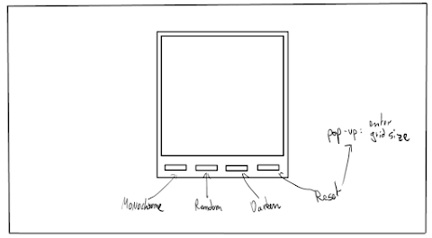

# ETCH-A-SKETCH
This project consists in a small html/CSS/JS web page where the user is able to essentially draw on an etch-a-sketch by hovering their mouse around.

This is the fourth project from the Odin Project's (Curriculum) [https://www.theodinproject.com/courses/web-development-101/lessons/etch-a-sketch-project]. More info and examples can be found there.

Here is a quick draft of what I want the webpage to look like:

